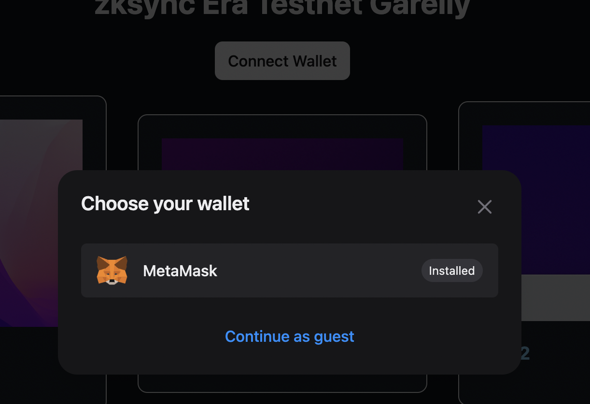
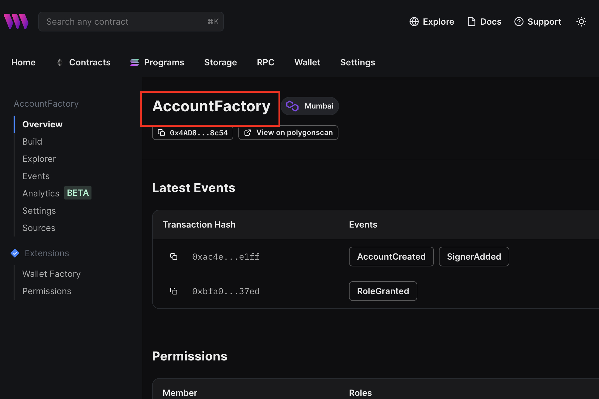

# 0 プロジェクトの概要

このプロジェクトは大きく次の４点から構成されます。

1. AIによる**ストーリーNFT**の作成
2. **zkEVM**による**スケーラビリティ**への対策
3. **「新しいウォレット」** を使用したターゲットの拡大とセキュリティの強化
  - **ローカルウォレット**
  - **スマートウォレット**
4. **Astar**による実装

以下、それぞれの説明です。

# 1 AIによるストーリーNFTの作成について


## 0 導入の理由

アートにとって**名づけ**は重要な意味を持ちます。

これは、**現代アートの父**ともいわれている**マルセル・デュシャン**が便器に「泉」という名前をつけたことが大きな契機になりました。


https://k-daikoku.net/duchamp-fontaine/

しかし、**現在のジェネレーティブNFT**のほとんどがいわゆる **「名前」** を持ちません。（○○ No.2345のような識別の名称がほとんどです。）

それは、仮に１万種類の場合、**１万種類の名前を人が作るのが現実的ではないこと**がその理由だと考えます。

また、**Description**についても同様です。

本来、一つ一つのNFTに **「ストーリー」** などがあればより際立ちますが、これも現実的ではありません。

これを**大量のデータを作ることができるAI**により、**名づけ、ストーリーの作成**を行い、**「名前」**を持った**新しいジェネレーティブNFT**を作成しました。

（もっとも、別の観点からこの課題を解決しようと試みた　**「ハッシュマスク」**　というプロジェクトも存在します。）

https://www.thehashmasks.com/

## 1 作成方法について

### 1. テーマの決定

まずは**ジェネレーティブNFTのテーマ**を決めます。

今回は **「少女とドラゴン」** というテーマでのNFTになります。

### 2. AIによるタイトルとストーリーの作成

chatGPTなどを用いて、AIで**テーマに沿ったタイトルとストーリー**を作成します。

例　「少女とドラゴン」というテーマのタイトルと100文字以内のストーリーを○○個作成してください。


今回はデモのため、50個を作成しています。

### 3. ストーリーからプロンプトの作成

前章でできたストーリーをもとに、**chatGPTなどを用いて、プロンプトを作成**します。

例　「。。。。。。。。。」というプロンプトを参考にして、○○個のストーリーをプロンプトとして作成してください。


なお、今回はこの部分で**手作業による修正**が生じています。

ただし、これはAIの発展とともに、精度が高くなるのではと予想しています。

### 4. プロンプトから画像の作成

前章でできた**プロンプトを元に画像を生成**します。

これらをもとにして、NFTを作成します。

以上により、**「タイトル」「ストーリー」「画像」に一貫性のあるNFT**の作成を行うことができました。

# 2 zkEVMによるスケーラビリティへの対策について

## 0 導入の理由

Ethereumは **「ブロックチェーンのトリレンマ」** のうち、「セキュリティ」「分散化」を重視しているため、**「スケーラビリティ」に課題**が残っています。

**zkEVM**はこの「セキュリティ」と「分散化」を損なうことなく、「スケーラビリティ」を解決する手段の一つであるため、採用しました。

## 1 作成済みコントラクト

zksync Era Testnetの**コントラクト**はこちら


https://thirdweb.com/zksync-era-testnet/0x322565EcD421a9FE92331b8FcF2E0B1B14B16AD2/nfts

## 2 スマートウォレットについて

thirdwebのアカウントアブストラクション作成のコントラクトである **「Simple Wallet Factory (beta)」** がzksyncEra Testnetで未対応でした。

https://thirdweb.com/thirdweb.eth/AccountFactory

そのため、この機能は**mumbai**で作ることとしました。

## 3 ローカルウォレットについて

ローカルウォレットの実装は可能でしたが、**ガスレストランザクション**で未対応箇所があったため、mumbaiで作りました。

当初考えていた構成は次のようになります。

### 1. thirdwebの機能を使い、ローカルウォレット作成 ⇨ 可能

### 2. OpenZeppelin Defenderによるリレイヤー・オートタスクの作成 ⇨ 可能

### 3. thirdwebによるフォワーダー使用 ⇨ **zksyncEra Testnet 未対応**


以下が、**対応しているチェーンの一覧**です。

https://github.com/thirdweb-dev/ozdefender-autotask?ref=blog.thirdweb.com


# 3 「新しいウォレット」を使用したターゲットの拡大とセキュリティの強化

## 1 ローカルウォレットについて

### 0.導入の理由

現状、**「メタマスク」などのウォレット**を持っていない場合、NFT配布イベントなどに参加することが困難です。

**その場で暫定的なウォレットを作成する「ローカルウォレット」** を採用することで、メタマスクなどのウォレットを持っていない層の参加を見込むことができます。

### 1.処理の流れ(概要)について
Webページから**その場でローカルウォレットを作成**し、**ガスレストランザクション**を利用して、NFTを取得します。

- URL
https://hackathon-story-nft-mumbai-ytakahashi2020.vercel.app/

- コントラクトアドレス
https://thirdweb.com/mumbai/0xBA3b193CfC90e92E3251896514f7654AF91c3389/nfts


### 2.処理の流れ（詳細）について

「Connect Wallet」押下時に **「continue as guest」** を選択し、ローカルウォレットを作成画面に遷移します。


任意のパスワードを設定した上で、**「Create a new wallet」** を選択します。


**「Backup wallet」** を押下することで、ローカルウォレットの情報を保存します。


なお、この保存情報の内容は下の記事にまとめています。

https://note.com/standenglish/n/nadf776c67084

以上で、**ローカルウォレット**が完成しました。


作成したばかりのウォレットであるため、**ガス代がありません。**

ガス代については、**OpenZeppelin Defender**を使用することにより、ガスレストランザクションを実現しています。

### 3.ガスレストランザクションについて

今回のコードは**thirdweb SDK**を使用しています。

「sdkOptions」から **「relayerURL」** を指定することで、**ガスレストランザクション**を実現しています。

```ts:_app.tsx
<ThirdwebProvider 
      activeChain={activeChain}
      supportedWallets={[
        metamaskWallet(),
        localWallet(),
      ]}
      sdkOptions={{
        gasless: {
          openzeppelin: {
            relayerUrl: "https://api.defender.openzeppelin.com/autotasks/e200a696-25ba-4c62-bc11-33707a1e724c/runs/webhook/9b4a6556-3f26-4b6a-8638-3c305d501266/T8PpSHE1DH2QCAW4BLADvo"
          }
        }
      }}
>
```

**「OpenZeppelin Defender」** の **「Relay」** でガスを代わりに支払うウォレットを作成します。

**「Autotask」** において、webhookを作成します。


## 2 スマートウォレットについて

### 0.導入の理由

量子コンピュータの発展により、将来、**公開鍵から秘密鍵が理論上導かれてしまう**とされています。

ERC4337の**アカウントアブストラクション**では**個々のロジックを変更する**ことができるため、量子耐性の強い署名方法に変更することが可能です。

そのため、将来の脅威への対策として、**アカウントアブストラクション**を利用したスマートウォレットを導入いたしました。

### 1.処理の流れ（概要）について

こちらの処理は今回実装した**パーソナルウォレットであるメタマスク**から**スマートウォレット**を作成し、「claim」により、**NFTを取得**しています。

- URL
https://story-nft-garelly-smart-wallet.vercel.app/

- コントラクトアドレス
https://thirdweb.com/mumbai/0xBA3b193CfC90e92E3251896514f7654AF91c3389/nfts

### 2.処理の流れ（詳細）について

「Connect Wallet」押下時に **「Smart Wallet」** を選択し、スマートウォレットを作成画面に遷移します。


**「Link Personal Wallet」** から、このアカウントに接続するためのウォレットを選択します。

ここでは、メタマスクからの接続を実装しています。


これで、**スマートウォレット**が作成できました。

なお、作成したばかりのため、スマートウォレットには**トークンがありません。**


Claim実行時に、実際にトランザクションを行うのは,thirdwebの**バンドラーアカウント**になります。

そのため、**今回はガス代は必要ありません。**

（これは、mumbaiがテストトークンであり、thirdwebがガス代を要求していないためです。
 メインネットではガス代が必要だと考えております。）

https://mumbai.polygonscan.com/tx/0x09ce4f81cf54b8256032d3cded39be494db2efd6f9128a30f0d1a79a2c7fbc2c

実際に処理を行う、**EntryPointコントラクト**はこちらで、これはthirdwebのコントラクトを利用しています。

https://mumbai.polygonscan.com/address/0x5ff137d4b0fdcd49dca30c7cf57e578a026d2789#code

### 3.thirdwebの「Simple Wallet Factory」について

今回、thirdwebを使用し、スマートウォレット作成のための**Facrtoryコントラクト**を作成します。


https://thirdweb.com/thirdweb.eth/AccountFactory

次のように、コントラクトを作成しました。



https://thirdweb.com/mumbai/0x4AD8B5a13114d44183f68250898cB546CADd8c54


### 4.実装コード箇所について

こちらが実装箇所になります。

**「factoryAddress」**　に上で設定したコントラクトアドレスを、**「thirdwebApiKey」**　に別で取得した、thirdwebのAPIキーを設定しています。

**「gasless」**　を「true」としてガスレストランザクションを実施し、**「PersonalWallet」**　に接続元であるメタマスクを入れています。
```ts:_app.tsx
<ThirdwebProvider 
      activeChain={activeChain}
      supportedWallets={[
        metamaskWallet(),
        smartWallet({
          factoryAddress: process.env.NEXT_PUBLIC_FACTORY_ADDRESS!,
          thirdwebApiKey: process.env.NEXT_PUBLIC_API_KEY!,
          gasless: true,
          personalWallets:[
            metamaskWallet()
          ]
        })
      ]}
      >
```

以上が**スマートウォレットを使用したNFTの取得**になります。

# 4 Astar Networkでのコントラクト・Garellyページの作成

thirdwebを利用し、Astarのコントラクト、Webページを作成しました。

- URL
https://hackathon-story-nft-astar.vercel.app/

- コントラクトアドレス
https://thirdweb.com/astar/0xa92d7e8eC2152B951F19746c4EcaC2768B7827Be


# 5 技術スタック

## フロントエンド等
- next.js
- typescript
- thirdwebSDK

## ブロックチェーン
- Astar
- zkSync Era Testnet
- mumbai

## その他
- OpenZeppelin Defender
- ERC4337（アカウントアブストラクション）

## Getting Started

Create a project using this example:

```bash
npx thirdweb create --template next-typescript-starter
```

You can start editing the page by modifying `pages/index.tsx`. The page auto-updates as you edit the file.

On `pages/_app.tsx`, you'll find our `ThirdwebProvider` wrapping your app, this is necessary for our [hooks](https://portal.thirdweb.com/react) and
[UI Components](https://portal.thirdweb.com/ui-components) to work.

### Deploy to IPFS

Deploy a copy of your application to IPFS using the following command:

```bash
yarn deploy
```

To learn more about thirdweb and Next.js, take a look at the following resources:

- [thirdweb React Documentation](https://docs.thirdweb.com/react) - learn about our React SDK.
- [thirdweb TypeScript Documentation](https://docs.thirdweb.com/typescript) - learn about our JavaScript/TypeScript SDK.
- [thirdweb Portal](https://docs.thirdweb.com) - check our guides and development resources.
- [Next.js Documentation](https://nextjs.org/docs) - learn about Next.js features and API.

You can check out [the thirdweb GitHub organization](https://github.com/thirdweb-dev) - your feedback and contributions are welcome!

## Join our Discord!

For any questions, suggestions, join our discord at [https://discord.gg/thirdweb](https://discord.gg/thirdweb).

